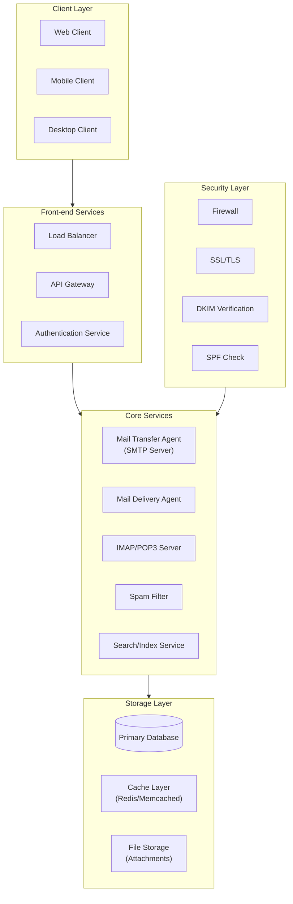

# local-mail
A local mail management agent

## Main Components

### 1. Client Layer
- Web Interface
- Mobile Apps
- Desktop Clients (Supporting IMAP/POP3)
- API Clients

### 2. Front-end Services
- Load Balancers
- API Gateway
- Authentication/Authorization
- Rate Limiting

### 3. Core Services
- **MTA (Mail Transfer Agent)**
  - Handles SMTP protocol
  - Routes incoming/outgoing mail
  - Queue management
- **MDA (Mail Delivery Agent)**
  - Local mail delivery
  - Mailbox management
  - Filtering rules
- **IMAP/POP3 Server**
  - Mail access protocols
  - Folder management
  - State synchronization

### 4. Storage Layer
- **Primary Database**
  - User accounts
  - Email metadata
  - Configuration
- **Cache Layer**
  - Session data
  - Frequently accessed emails
  - Search indices
- **File Storage**
  - Email bodies
  - Attachments
  - Backup storage

### 5. Security Layer
- Firewall & DDoS Protection
- SSL/TLS Encryption
- DKIM/SPF/DMARC
- Anti-spam/Anti-virus
- Access Control

## TODOS
- [ ] Compliance
- [ ] Local data protection laws
- [ ] Email retention policies
- [ ] Privacy regulations
- [ ] Implementation of core services
- [ ] Security layer setup
- [ ] Storage system design
- [ ] Client interface development

## Diagram

