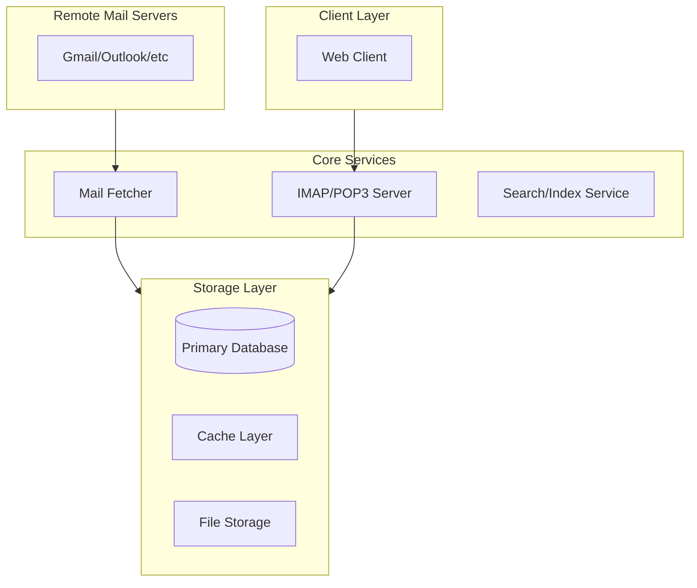

# local-mail
A local mail management agent that fetches and manages emails from your existing email accounts

## Main Components

### 1. Client Layer
- Web Interface

### 2. Core Services
- **Mail Fetcher**
  - Connects to remote email servers (IMAP/POP3)
  - Fetches new emails periodically
  - Manages email synchronization
- **IMAP/POP3 Server**
  - Local mail access
  - Folder management
  - State synchronization

### 3. Storage Layer
- **Primary Database**
  - Email metadata
  - Account configurations
  - Sync status
- **Cache Layer**
  - Frequently accessed emails
  - Search indices
- **File Storage**
  - Email bodies
  - Attachments
  - Backup storage

## Diagram

## TODOS
- [ ] Implementation of mail fetcher
- [ ] Storage system design
- [ ] Client interface development
- [ ] Email provider integration
- [ ] Sync status tracking
